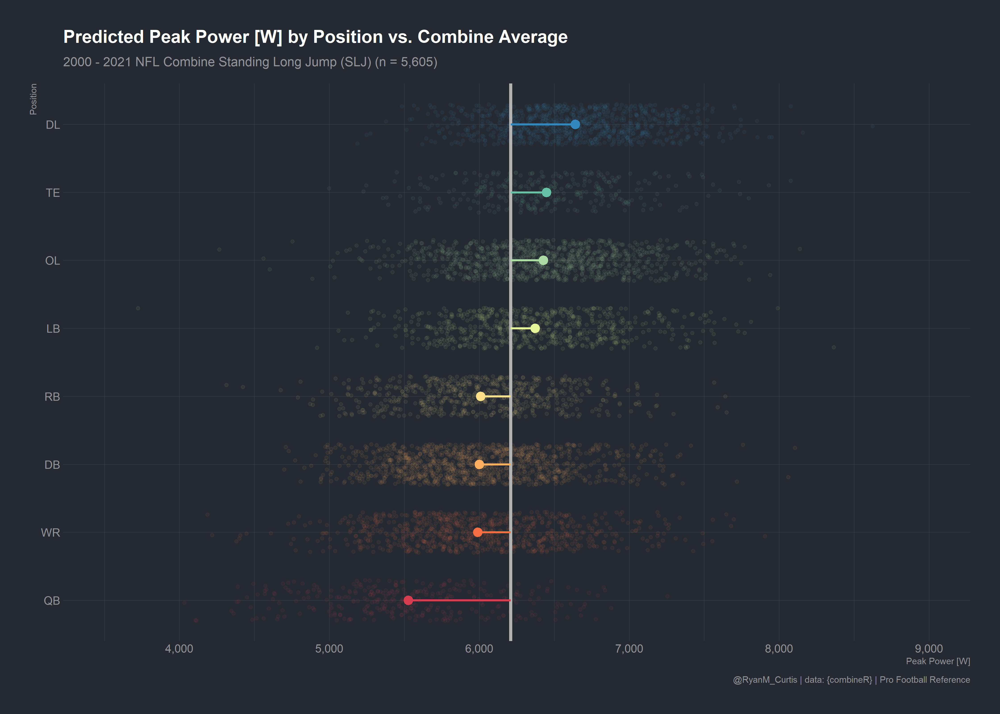

***
# combineR-visuals

## Info

This repo contains a collection of visual built using the [{combineR}](https://github.com/rmcurtis43/combineR) package. Code for each chart is located in the R file.

***

## Examples

***

***

***

